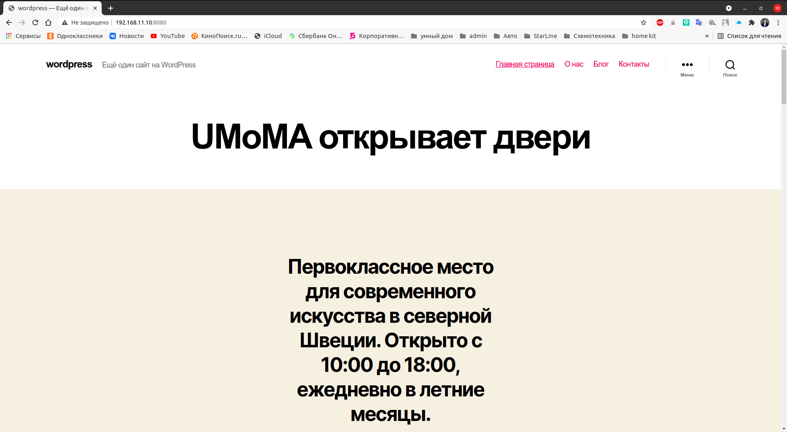

## Динамический WEB.

Развернуть веб приложения:
- nginx + php-fpm (laravel/wordpress) + python (flask/django) + js(react/angular) nginx + java (tomcat/jetty/netty) + go + ruby можно свои комбинации

Реализации на выбор:
- на хостовой системе через конфиги в /etc
- деплой через docker-compose

### Реализация.
Для развертывания веб приложения подготовим сервер с сайтами:

- Сайт Wordpress (nginx + php-fpm)
- nginx + python (flask/django)
- nginx + python (flask/django)

Поднимаем стенд `vagrant up`.

Проверка сайта Wordpress
------------------------

В браузере открыть [http://192.168.11.10:8080/](http://192.168.11.10:8080/)

Проверка сайта Wordpress
------------------------

В браузере открыть [http://192.168.11.10:8081/](http://192.168.11.10:8081/)

Проверка сайта Wordpress
------------------------

В браузере открыть [http://192.168.11.10:8082/](http://192.168.11.10:8082/)

